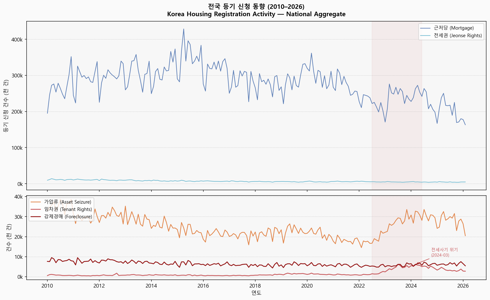

# 시군구별 주거신용위험 동향 분석

**District-Level Housing Credit Risk Time-Series for Korea (2010–Present)**

The first publicly available 시군구-level 등기통계 시계열 분석.

---

## What this is

A monthly district-level housing credit risk index covering all 228 시군구 across Korea,
built from 16 years of court registration data (2010–present) sourced from the official
등기정보광장 공식 OpenAPI.

Five registration types form a complete distress pipeline:

| Signal | What it measures | Role in pipeline |
|---|---|---|
| **근저당** | Mortgage origination volume | Baseline credit activity — earliest signal |
| **가압류** | Provisional asset seizure | Debt enforcement — creditors freezing assets before suit |
| **강제경매** | Foreclosure filings | Terminal distress — irreversible enforcement |
| **임차권** | Tenant lease rights protection | Landlord default — 전세사기 signal |
| **전세권** | Jeonse rights registrations | Jeonse market exposure by district |

No single signal is sufficient. The composite of all five — trended monthly over 16 years,
at 시군구 granularity — is the product.

---

## Why this matters

Everyone knows 전세사기 happened. No one has shown **where exactly** and **how it evolved
month by month by district**.

National statistics show a crisis. District-level data shows 228 different stories — some
districts peaked early and recovered, others are still deteriorating, and others were never
affected at all. That geographic specificity is what makes the data valuable for lending
decisions and what no existing product provides.

---

## Key findings (2026년 3월 기준)

| 시군구 | 위험 단계 | 추세 |
|---|---|---|
| 경기 평택시 | Terminal | ↑ 상승 |
| 서울 영등포구 | Terminal | ↑ 상승 |
| 서울 금천구 | Terminal | → 유지 |
| 경기 광주시 | Terminal | → 유지 |
| 경기 수원시 | Terminal | ↓ 완화 |

- **임차권→강제경매 전이 시차:** 시군구 중앙값 17개월. 2022–2023년 피해 접수가 강제경매로 전환되는 시점이 2024–2025년 현재 진행 중.
- **지역 집중도:** 2023년 임차권설정등기명령의 39.5%가 상위 10개 시군구에서 발생 (2010년 30.1%).
- **위기 분화:** 228개 시군구 중 5개가 최고위험(Terminal) 단계를 유지하는 반면, 다수 지역은 이미 회복 또는 안정 단계.

위험 단계는 5개 등기유형의 표준화 복합지수 기반 분류. 전체 방법론은 [METHODOLOGY.md](METHODOLOGY.md) 참조.

---

## Data provenance

All data is sourced from **등기정보광장 공식 OpenAPI** (대법원 전자등기소 운영,
data.iros.go.kr) using officially issued service keys. No scraping, no session hijacking,
no leaked data.

- **Source:** 등기정보광장 공식 Open API (서비스키 기반)
- **Coverage:** 228 시군구, 17 시도 (including 세종특별자치시)
- **Depth:** January 2010 – present (monthly granularity)
- **Types:** 임차권, 강제경매, 가압류, 전세권, 근저당

---

## National trend (2010–2026)

Top panel: credit activity signals (근저당, 전세권). Bottom panel: distress signals (가압류, 임차권, 강제경매).
Shaded region marks the 전세사기 crisis window (2022–2024). The 임차권 spike — tenant rights
registrations as landlords defaulted — is the most concentrated signal in the dataset.

---

## Sample report

→ **[수원시 District Snapshot — March 2026 (PDF)](reports/pdf/snapshot_수원시_2026_03.pdf)**

A 2-page district-level snapshot covering registration trend, distress stage classification,
and year-on-year comparison. Full institutional reports available upon inquiry.

---

## Repository contents

| File | Description |
|---|---|
| `PRODUCT_SPEC.md` | Full product specification — what's in the index, who it's for |
| `METHODOLOGY.md` | Data sourcing and methodology (high-level) |
| `CROSS_VALIDATION.md` | Framework for validating against external public datasets |
| `reports/charts/` | Public chart exports |
| `reports/pdf/` | Sample district reports |

---

## Status

**Dataset complete (2026-03-20).** 222,903 rows covering all 228 시군구 × 5 registration types
× January 2010 – March 2026. Zero errors. Full 16-year monthly time series at 시군구 granularity.

**Full institutional report and dataset access:** available upon inquiry (see Contact below).

---

## Contact

For institutional inquiries (저축은행, 상호금융, 보증기관, 연구기관):
- GitHub Issues on this repository
- Or reach out directly via the profile on this account

---

## License

Data analysis outputs in `reports/` are released under [CC BY-NC 4.0](https://creativecommons.org/licenses/by-nc/4.0/).
The underlying raw dataset and collection methodology are proprietary.
